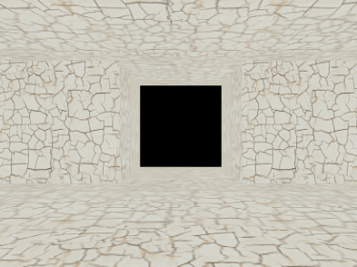

## 加载场景，基本相机操作

从文件加载模型数据，并控制相机实现在模型中行走。

效果如图11。

>

>图11

```javascript
<div id="loadingtext">正在加载世界……</div>
```
加载文件可能需要些时间，放一句提示能适当提高用户体验，在这个基础上也可以根据自己的喜好加一些css，再在加载完成之后用JS代码去掉这个提示。

```javascript
function webGLStart()
{
    //...
	loadWorld();
	gl.enable(gl.DEPTH_TEST);
}
function loadWorld()
{
	$.getJSON(
		"/Public/json/world.json",
		function(data)
		{
			handleLoadedWorld(data);
		}
	);
}
```
DEPTH_TEST这次是需要的。用jQuery的ajax来拿存好的数据world.json，由于json是JS常用数据传输格式，这里的getJSON是$.ajax方法的特例。关于ajax、get、post这里就不多解释了。

```javascript
var worldVertexPositionBuffer = null;
var worldVertexTextureCoordBuffer = null;
function handleLoadedWorld(data)
{
	var vertexCount = 0;
	var vertexPositions = [];
	var vertexTextureCoords = [];

	for(var i = 0; typeof(data[i]) != "undefined"; i ++)
	{
		//环境中一个部分的顶点坐标
		vertexPositions =
			vertexPositions.concat(data[i].vertexPositions);
		//然后是纹理坐标
		vertexTextureCoords =
			vertexTextureCoords.concat(data[i].vertexTextureCoords);
		vertexCount ++;
	}
	worldVertexPositionBuffer = gl.createBuffer();
	gl.bindBuffer(gl.ARRAY_BUFFER, worldVertexPositionBuffer);
	gl.bufferData(gl.ARRAY_BUFFER,
		new Float32Array(vertexPositions), gl.STATIC_DRAW);
	worldVertexPositionBuffer.itemSize = 3;
	worldVertexPositionBuffer.numItems = data.vertexCount;

	worldVertexTextureCoordBuffer = gl.createBuffer();
	gl.bindBuffer(gl.ARRAY_BUFFER, worldVertexTextureCoordBuffer);
	gl.bufferData(gl.ARRAY_BUFFER,
		new Float32Array(vertexTextureCoords), gl.STATIC_DRAW);
	worldVertexTextureCoordBuffer.itemSize = 2;
	worldVertexTextureCoordBuffer.numItems = data.vertexCount;

	$("#loadingtext").text("");
}
```
从事先准备的json文件拿到顶点与纹理的坐标数据，把数据放到对应数组里之后，就是我们熟悉的事情了。这里的world.json只是自己编写的数据，是标准的json格式，不过并不是什么规范的3D数据。

```javascript
function drawScene()
{
    //...
	mat4.rotate(mvMatrix, mvMatrix, degToRad(-pitch), [1, 0, 0]);
	mat4.rotate(mvMatrix, mvMatrix, degToRad(-yaw), [0, 1, 0]);
	mat4.translate(mvMatrix, mvMatrix, [-xPos, -yPos, -zPos]);
}
```
设置相机，让视角在场景中移动。WebGL并不支持直接的相机操作，不过模拟一个不难。相机需要怎么动，让整个场景相反地动。

```javascript
var pitch = 0;
var pitchRate = 0;

var yaw = 0;
var yawRate = 0;
var xPos = 0;
var yPos = 0.4;
var zPos = 0;

var speed = 0;
function handleKeys()
{
	if(currentlyPressedKeys[188])
	{
		//","/"<"逗号键
		pitchRate = -0.1;
	}
	else if(currentlyPressedKeys[190])
	{
		//"."/">"句号键
		pitchRate = 0.1;
	}
	else
	{
		pitchRate = 0;
	}
	if (currentlyPressedKeys[65])
	{
		//A
		yawRate = 0.1;
	}
	else if (currentlyPressedKeys[68])
	{
		//D
		yawRate = -0.1;
	}
	else
	{
		yawRate = 0;
	}
	if(currentlyPressedKeys[87])
	{
		//W
		speed = 0.003;
	}
	else if(currentlyPressedKeys[83])
	{
		//S
		speed = -0.003;
	}
	else
	{
		speed = 0;
	}
}
var lastTime = 0;
var joggingAngle = 0;
function animate()
{
	var timeNow = new Date().getTime();
	if(lastTime != 0)
	{
		var elapsed = timeNow - lastTime;
		if(speed != 0)
		{
			xPos -= Math.sin(degToRad(yaw)) * speed * elapsed;
			zPos -= Math.cos(degToRad(yaw)) * speed * elapsed;
			joggingAngle += elapsed * 0.6;
			yPos = Math.sin(degToRad(joggingAngle)) / 20 + 0.4;
		}
		yaw += yawRate * elapsed;
		pitch += pitchRate * elapsed;
	}
	lastTime = timeNow;
}
```
和之前处理移动类似，把XZ理解为运动的平面，Y理解为高度，joggingAngle是个有意思的小把戏，模仿走得过程的“颠簸”，玩FPS游戏应该都能感觉到。

本节主要介绍了一种数据获取的方式和模拟相机效果的实现技巧，具体的代码都是已经熟悉的内容了。
