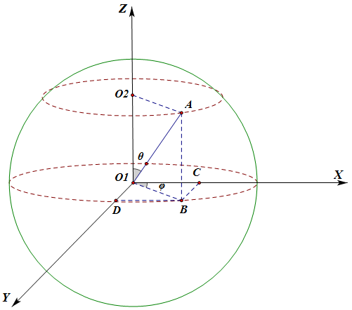
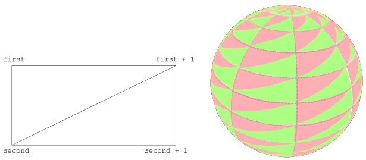

## 球、旋转矩阵、鼠标事件

这一节我们做一个球体，贴上月球的纹理，加入鼠标的交互。

效果如图12。

>

>图12

光照方面使用第七节的代码，不再多说。

```javascript
function webGLStart()
{
    //...
	canvas.mousedown(handleMouseDown);
	$(document).mouseup(handleMouseUp);
	$(document).mousemove(handleMouseMove);
}
````
类似键盘事件，让鼠标事件触发我们的函数。这里鼠标按下绑定的canvas，表示在canvas外面按下鼠标是没有效果的，而鼠标移动依然是$(document)，在canvas内按下鼠标之后移出canvas依然可以保持交互效果。可以把canvas和$(document)相互修改一下试试效果。

```javascript
var moonVertexPositionBuffer;
var moonVertexNormalBuffer;
var moonVertexTextureCoordBuffer;
var moonVertexIndexBuffer;
function initBuffers()
{
	var latitudeBands = 30;
	var longitudeBands = 30;
	var radius = 2;
	var vertexPositionData = [];
	var normalData = [];
	var textureCoordData = [];
	for(var latNumber = 0; latNumber <= latitudeBands; latNumber ++)
	{
		var theta = latNumber * Math.PI / latitudeBands;
		var sinTheta = Math.sin(theta);
		var cosTheta = Math.cos(theta);
		for(var longNumber = 0; longNumber <= longitudeBands; longNumber ++)
		{
			var phi = longNumber * 2 * Math.PI / longitudeBands;
			var sinPhi = Math.sin(phi);
			var cosPhi = Math.cos(phi);
			var x = cosPhi * sinTheta;
			var y = cosTheta;
			var z = sinPhi * sinTheta;
			var u = 1 - (longNumber / longitudeBands);
			var v = 1 - (latNumber / latitudeBands);

			normalData.push(x);
			normalData.push(y);
			normalData.push(z);
			textureCoordData.push(u);
			textureCoordData.push(v);
			vertexPositionData.push(radius * x);
			vertexPositionData.push(radius * y);
			vertexPositionData.push(radius * z);
		}
	}
```
画一个球体，表面是由多个四边形来近似的，有一些基础几何知识就比较容易理解了。想一想或查一查地球仪，看看经纬度的划分，画出的等间距经线与纬线把地球表面划分成一个个曲面四边形（南北极周围是三角形，为了方便，极点也直接算成多个重合的点，这样在代码处理中就都当四边形了），我们用平面四边形来近似它们。

>

>图13，球面坐标

如图13所示，球坐标系统中，球表面任意一点的坐标，由一个与Z轴正方向的夹角θ（0~180°），和原点与该点在XY平面投影点连线与X轴正方向夹角φ（0~360°）决定。

在图中，|O1A|就是球的半径r，在XY平面的投影|O1B|=|O1A|*sin(θ)。于是：
```
X坐标值x为：|O1C|=|O1B|*sin(φ)  --> x=r*sin(θ)*cos(φ);
Y坐标值y为：|O1D|=|O1B|*sin(φ)  --> y=r*sin(θ)*sin(φ);
Z坐标值z为：|O1O2|=|O1A|*cos(θ) --> z=r*cos(θ);
```
均匀枚举θ和φ，然后算出每个点的坐标。我们的视角一直相当于从Z轴俯视，“上”方向相当于是Y轴正方向，所以代码中把Y和Z的计算互换了一下。

球体表面每个点的法向量都是球心与点连线方向，所以为计算光照而需要的法向量刚好在计算坐标的时候就得到了。

```javascript
	var indexData = [];
	for(var latNumber = 0; latNumber < latitudeBands; latNumber ++)
	{
		for(var longNumber = 0; longNumber < longitudeBands; longNumber ++)
		{
			var first = (latNumber * (longitudeBands + 1)) + longNumber;
			var second = first + longitudeBands + 1;
			indexData.push(first);
			indexData.push(second);
			indexData.push(first + 1);
			indexData.push(second);
			indexData.push(second + 1);
			indexData.push(first + 1);
		}
	}
	//...createBuffer()，bindBuffer()，bufferData()，itemSize，numItems等
}
```
得到每个点坐标之后，还得合理组织这些四边形，在计算坐标时候我们是按顺序“一圈一圈”像削平果一样算下来的，于是再一圈一圈把四边形像过去的方法一样用两个三角形表示，把顶点序号组织成一个个三角形，如图14：

>

>图14，球面分割的小四边形的序号组织

```javascript
var mouseDown = false;
var lastMouseX = null;
var lastMouseY = null;
var moonRotationMatrix = mat4.create();
mat4.identity(moonRotationMatrix);
function handleMouseDown(event)
{
	mouseDown = true;
	lastMouseX = event.clientX;
	lastMouseY = event.clientY;
}
function handleMouseUp(event)
{
	mouseDown = false;
}
function handleMouseMove(event)
{
	if(!mouseDown)
	{
		return;
	}
	var newX = event.clientX;
	var newY = event.clientY;
	var newRotationMatrix = mat4.create();
	mat4.identity(newRotationMatrix);

	var deltaX = newX - lastMouseX;
	mat4.rotate(newRotationMatrix, newRotationMatrix,
		degToRad(deltaX / 10), [0, 1, 0]);
	var deltaY = newY - lastMouseY;
	mat4.rotate(newRotationMatrix, newRotationMatrix,
		degToRad(deltaY / 10), [1, 0, 0]);

	mat4.multiply(moonRotationMatrix, newRotationMatrix, moonRotationMatrix);

	lastMouseX = newX;
	lastMouseY = newY;
}
```
用一个moonRotationMatrix记录累积旋转的状态，每次新的旋转乘在moonRotationMatrix上，在让mvMatrix去乘以它。这里旋转矩阵用了乘，则要注意左乘右乘了，可以试试调换相乘两个矩阵的顺序看会发生什么。再说明一下gl-matrix的2.x版本，第一个参数都是输出。

这里我有过一个疑惑，在鼠标斜着移动时候，先绕X和先绕Y真的都没关系么？于是用两个矩阵分别计算两个旋转顺序的结果并比较，是不同的。但是为什么实际体验中似乎并没有什么问题（想象一下，如果鼠标从中心出发往左下斜着走很远，那先绕X走很远和先绕Y走，应该最后一个落在Y轴上，一个落在X轴上，而不是预期的落在左下方，可是实际操作却并不如此）。导致这个效果是因为这个计算并不是“一下子”完成的，handleMouseMove()在tick周期中执行，大约每秒60次，鼠标移动的这个计算过程被细分了，产生了“积分”的效果，于是我们往左下移动鼠标的过程，近似了绕着[左上/右下]方向轴旋转的操作。

