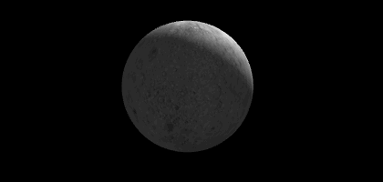

## 点光源

效果如图15。

>

>图15

```javascript
var textureFlag = [0, 0];
var startTick = false;
var waitTick;
function webGLStart()
{
    //...
	waitTexture = setInterval("tick()", 100);
}
function tick()
{
	if(textureFlag[0] == 1 && textureFlag[1] == 1)
	{
		startTick = true;
		textureFlag[0] = 2;
		textureFlag[1] = 2;
		clearInterval(waitTexture);
	}
	if(startTick)
	{
		requestAnimFrame(tick);
		drawScene();
		animate();
	}
}
```
这次让板条箱和月亮围着一个中心点旋转，需要加载两个纹理，加载速度慢的话那个关于texture的WARNING就又回来了。为了确保纹理加载完之后再tick()，增加了三个标记和一个定时器。代码逻辑还好理解，用setInterval轮询纹理是否加载完毕而不用while，是因为while执行太快了，会卡的，100ms询问一次就可以了。textureFlag在分别在两个纹理加载完成的时候变为true。

```javascript
var lastTime = 0;
function animate()
{
	var timeNow = new Date().getTime();
	if(lastTime != 0)
	{
		var elapsed = timeNow - lastTime;

	 	moonAngle += 0.05 * elapsed;
	 	cubeAngle += 0.05 * elapsed;
	}
	lastTime = timeNow;
}
```
要让它们旋转，animate自然要放回来的。

```javascript
function drawScene()
{
    //...
	var lighting = $("#lighting").is(":checked");
	gl.uniform1i(shaderProgram.useLightingUniform, lighting);
	if(lighting)
	{
		gl.uniform3f(
			shaderProgram.ambientColorUniform,
			parseFloat($("#ambientR").val()),
			parseFloat($("#ambientG").val()),
			parseFloat($("#ambientB").val())
			);
		gl.uniform3f(
			shaderProgram.pointLightingLocationUniform,
			parseFloat($("#lightPositionX").val()),
			parseFloat($("#lightPositionY").val()),
			parseFloat($("#lightPositionZ").val())
		);

		gl.uniform3f(
			shaderProgram.pointLightingColorUniform,
			parseFloat($("#pointR").val()),
			parseFloat($("#pointG").val()),
			parseFloat($("#pointB").val())
		);

	}
```
点光源的参数还是和之前类似方法用uniform给出。
```javascript

	mat4.identity(mvMatrix);
	mat4.translate(mvMatrix, mvMatrix, [0, 0, -20]);

	mvPushMatrix();

	mat4.rotate(mvMatrix, mvMatrix, degToRad(moonAngle), [0, 1, 0]);
	mat4.translate(mvMatrix, mvMatrix, [5, 0, 0]);

    //...绘制月亮，和之前绘制月亮一样。

	mvPopMatrix();

	mvPushMatrix();
	mat4.rotate(mvMatrix, mvMatrix, degToRad(cubeAngle), [0, 1, 0]);
	mat4.translate(mvMatrix, mvMatrix, [5, 0, 0]);

	//...绘制板条箱，和前面绘制板条箱一样。
}
```
利用mvPopMatrix()和mvPushMatrix()，就把月亮的绘制和板条箱的绘制独立开来，都从原点平移相同距离，再旋转不同角度。
```html
<script id = "shader-vs" type = "x-shader/x-vertex">
    //...
	uniform vec3 uPointLightingLocation;
	uniform vec3 uPointLightingColor;

	void main(void)
	{
	    vec4 mvPosition = uMVMatrix * vec4(aVertexPosition, 1.0);
	    gl_Position = uPMatrix * mvPosition;
	    vTextureCoord = aTextureCoord;
	    if (!uUseLighting)
	    {
	        vLightWeighting = vec3(1.0, 1.0, 1.0);
	    }
	    else
	    {
	        vec3 lightDirection =
	        	normalize(uPointLightingLocation - mvPosition.xyz);
	        vec3 transformedNormal = uNMatrix * aVertexNormal;
	        float directionalLightWeighting =
	        	max(dot(transformedNormal, lightDirection), 0.0);
	        vLightWeighting =
	        	uAmbientColor + uPointLightingColor * directionalLightWeighting;
	    }
	}
</script>
```
点光源照来的光，与相同方向照来的平行光是没有两样的，利用当前计算的点移动到的位置mvPosition，和点光源的位置uPointLightingLocation，就算出了点光源照到该点的方向，而这个方向向量就可以和前面章节计算方向光效果一样方法使用了。于是在计算gl_Position的时候，与之前不同地分了两步，先计算了mvPosition。


