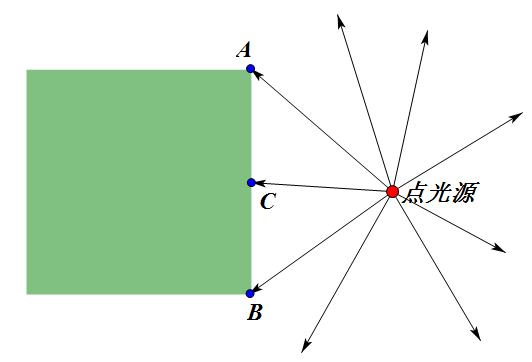

## 逐片元光照，多着色方案切换

效果如图16。

>

>图16

经过前面的章节，应该已经理解了顶点着色器、片元着色器这两部分别针对的是什么样的数据。之前我们计算光照，是在顶点着色器中，计算出每个顶点的光照增益，这个增益值在传给片元着色器的过程中，会在顶点与顶点之间差值。想一下图17的情况。

效果如图17。

>

>图17

光源照在A点和B点，计算出的增益效果是很接近的，且都比较暗。按照常理，光源照在C位置，由于几乎是垂直照射，应该比A和B的位置亮很多。而在逐顶点计算光照的过程中，由于C不是顶点，它的光照增益是由A到B差值得到的，那么将和A、B的光照增益接近。

在逐片元计算光照过程中，我们在顶点着色器中只计算A和B在矩阵变换后的法向量，这个法向量也将在传给片元着色器的过程中差值，图17的情况C和A、B的法向量相同。在片元着色器再计算光照增益，C的法向量方向与点光源照到C的方向几乎相同，就能计算出更为真实的光照效果。对于弧面，通过法向量的差值，就可以得到平滑的法向量变化，进而得到平滑的光照效果。[维基百科这张图](http://en.wikipedia.org/wiki/File:Phong-shading-sample.jpg)形象说明了逐顶点与逐片元在处理弧面光照效果的差别。

>

>图18

本例的演示页，打开/关闭逐片元计算光照，可以看到板条箱中间的光照效果不同。关闭纹理，就更容易看出月球表面光照效果在使用逐片元计算光照时更为平滑。
```html
<script id = "per-vertex-lighting-vs" type = "x-shader/x-vertex">
//...
</script>
<script id = "per-vertex-lighting-fs" type = "x-shader/x-fragment">
//...
</script>
```
把之前逐顶点计算光照的shader控件的id改一下，作为区分。

```html
<script id = "per-fragment-lighting-vs" type = "x-shader/x-vertex">
	attribute vec3 aVertexPosition;
	attribute vec3 aVertexNormal;
	attribute vec2 aTextureCoord;

	uniform mat4 uMVMatrix;
	uniform mat4 uPMatrix;
	uniform mat3 uNMatrix;

	varying vec2 vTextureCoord;
	varying vec3 vTransformedNormal;
	varying vec4 vPosition;


	void main(void)
	{
		vPosition = uMVMatrix * vec4(aVertexPosition, 1.0);
		gl_Position = uPMatrix * vPosition;
		vTextureCoord = aTextureCoord;
		vTransformedNormal = uNMatrix * aVertexNormal;
	}
</script>
<script id = "per-fragment-lighting-fs" type = "x-shader/x-fragment">
	precision mediump float;

	varying vec2 vTextureCoord;
	varying vec3 vTransformedNormal;
	varying vec4 vPosition;

	uniform bool uUseLighting;
	uniform bool uUseTextures;

	uniform vec3 uAmbientColor;

	uniform vec3 uPointLightingLocation;
	uniform vec3 uPointLightingColor;

	uniform sampler2D uSampler;


	void main(void)
	{
		vec3 lightWeighting;
		if (!uUseLighting)
		{
			lightWeighting = vec3(1.0, 1.0, 1.0);
		}
		else
		{
			vec3 lightDirection =
				normalize(uPointLightingLocation - vPosition.xyz);

			float directionalLightWeighting =
				max(dot(normalize(vTransformedNormal), lightDirection), 0.0);
			lightWeighting =
				uAmbientColor + uPointLightingColor * directionalLightWeighting;
		}

		vec4 fragmentColor;
		if (uUseTextures)
		{
			fragmentColor =
				texture2D(uSampler, vec2(vTextureCoord.s, vTextureCoord.t));
		}
		else
		{
			fragmentColor = vec4(1.0, 1.0, 1.0, 1.0);
		}
		gl_FragColor = vec4(fragmentColor.rgb * lightWeighting, fragmentColor.a);
	}
</script>
```
加入新的逐片元计算光照的shader。可以看到，顶点着色器的任务变少了，只需要计算好法向量。片元着色器得到差值后的法向量后，用类似逐顶点计算光照的顶点着色器的方法来计算光照增益。要注意的是差值后的法向量不一定是单位向量，我们需要把它normalize()一下。

```javascript
var currentProgram;
var perVertexProgram;
var perFragmentProgram;
function initShaders()
{
	perVertexProgram =
		createProgram("per-vertex-lighting-vs", "per-vertex-lighting-fs");
	perFragmentProgram =
		createProgram("per-fragment-lighting-vs", "per-fragment-lighting-fs");
}
```
把之前的initShaders写成了createProgram这个用来调用的函数，分别加载两种着色器方案。

```javascript
function drawScene()
{
    //...
	var perFragmentLighting = $("#per-fragment").is(":checked");
	if(perFragmentLighting)
	{
		currentProgram = perFragmentProgram;
	}
	else
	{
		currentProgram = perVertexProgram;
	}
	gl.useProgram(currentProgram);


}
```
不同的shader都加载编译链接好之后，就可以这样在绘制的时候切换了。
