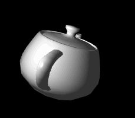

## 镜面高光

效果如图19。

>

>图19

计算高光我们用逐片元着色，顶点shader不用修改，在片元shader中计算镜面高光。
```html
<script id = "per-fragment-lighting-fs" type = "x-shader/x-fragment">
    //...
    uniform float uMaterialShininess;
    uniform bool uShowSpecularHighlights;

	uniform vec3 uPointLightingLocation;
    uniform vec3 uPointLightingSpecularColor;
	uniform vec3 uPointLightingDiffuseColor;

	uniform sampler2D uSampler;

	void main(void)
	{
		vec3 lightWeighting;
		if (!uUseLighting)
		{
			lightWeighting = vec3(1.0, 1.0, 1.0);
		}
		else
		{
			vec3 lightDirection =
				normalize(uPointLightingLocation - vPosition.xyz);
			vec3 normal = normalize(vTransformedNormal);

			float specularLightWeighting = 0.0;

			if(uShowSpecularHighlights)
			{
```
这里我们保留了在片元shader前已插值的法向量并归一化，作为中间变量。

高光开关如果是关闭的话增益为0 。

计算镜面反射亮度的方程为：
* > (R<sub>m</sub> * V)<sup>α</sup>

R<sub>m</sub>是光线在该点镜面反射后的归一化方向向量，V是眼（相机）到该点的归一化方向向量，α描述光洁度，α越大则越光亮，相当于材质的反光特征。
```html
				vec3 eyeDirection = normalize(-vPosition.xyz);
```
我们的相机一直在原点，所以这个向量很好算。
```html
				vec3 reflectionDirection = reflect(-lightDirection, normal);
```
GLSL提供了计算反射向量的函数reflect，lightDirection加负号是因为为了方便计算漫反射颜色，我们前面计算的lightDirection变量方向和光线是相反的。
```html
				specularLightWeighting =
					pow(max(dot(reflectionDirection, eyeDirection), 0.0),
					uMaterialShininess);
			}
```
用公式计算镜面反射增益。
```html
			float diffuseLightWeighting = max(dot(normal, lightDirection), 0.0);
			lightWeighting = uAmbientColor +
	            uPointLightingSpecularColor * specularLightWeighting +
	            uPointLightingDiffuseColor * diffuseLightWeighting;
		}

		////vec4 fragmentColor;
		//...
		gl_FragColor = vec4(fragmentColor.rgb * lightWeighting, fragmentColor.a);
	}
</script>
```
最后计算总颜色增益还是把它们加起来。

前面我们加载过json数据，这一节一样方式加载茶壶的数据，具体参考完整代码。
