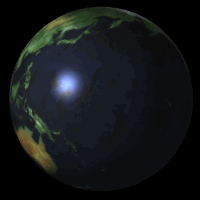
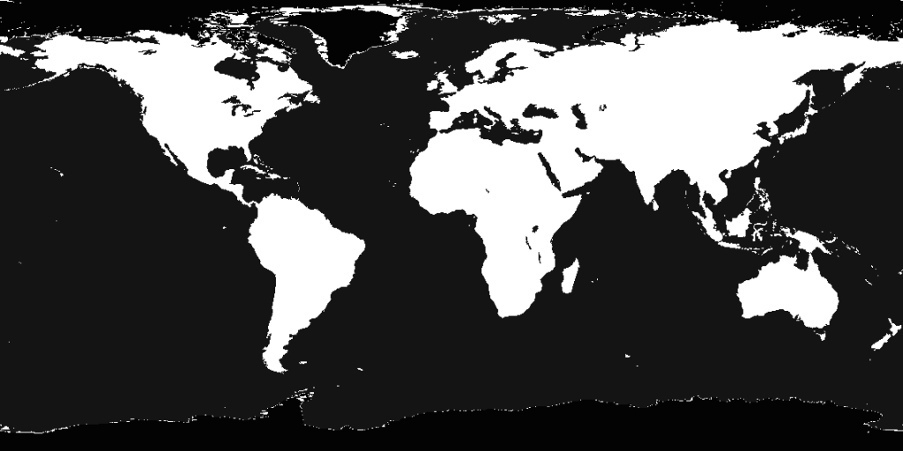

## 镜面地图

效果如图20。

>

>图20

我们要地球仪上镜面反射光在陆地和海洋部分不相同，甚至不同位置都有独特的镜面反射效果设置，于是需要在片元着色时候有海洋还是陆地这样区分位置的标记信息。

海洋和陆地是纹理决定的，我们用另一个和地球纹理对应的低色彩分辨率纹理来做标记就很不错。

>

>图21

代码是人写的，把它当纹理加载进去传给shader，然后在shader中不把它当纹理用，而是计算高光用，这个很自由。加载两个纹理，原来的纹理做纹理贴图，低色彩分辨率纹理只当高光效果标记。

```javascript
function drawScene()
{
    //...
	gl.activeTexture(gl.TEXTURE0);
	gl.bindTexture(gl.TEXTURE_2D, earthColorMapTexture);
	gl.uniform1i(shaderProgram.specularMapSamplerUniform, 0);

	gl.activeTexture(gl.TEXTURE1);
	gl.bindTexture(gl.TEXTURE_2D, earthSpecularMapTexture);
	gl.uniform1i(shaderProgram.specularMapSamplerUniform, 1);
}
```
之前我们加载板条箱与月球两个纹理的时候，由于它们是分别绘制的，互不相干，所以只用一个纹理缓存就可以。而这里我们需要在shader中同时使用两个纹理，就用到了两个纹理缓存。
```html
<script id = "per-fragment-lighting-fs" type = "x-shader/x-fragment">
	//...
	uniform sampler2D uColorMapSampler;
	uniform sampler2D uSpecularMapSampler;
	void main(void)
	{
	    //...
	        float shininess = 32.0;
	        if (uUseSpecularMap)
	        {
	            shininess =
	            	texture2D(uSpecularMapSampler,
	            	vec2(vTextureCoord.s, vTextureCoord.t)).r * 255.0;
	        }
        //...
	}
</script>
```
用另一个纹理计算了新的高光参数，就得到了不同位置高光不同的效果。

