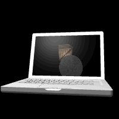

## 渲染到纹理

这一节实现在纹理中渲染3D场景，这是个很有用的方法，可以用来实现鼠标选取物体、倒影等许多3D效果。

如图22

>

>图22

```javascript
function webGLStart()
{
    //...
	initTextureFramebuffer();
	loadLaptop();
}
```
先读取一个笔记本电脑模型的json文件，这个和之前的方法一样。

这一节的重头戏是帧缓冲（FrameBuffer），
