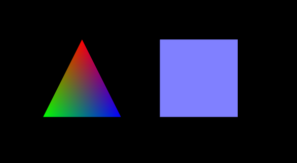

## 添加颜色

本节在上节基础上添加颜色，效果如图2。

>

>图2

在着色器中添加与颜色有关的代码，并对应修改相关函数与着色器变量的关系。

首先是顶点着色器。
```javascript
<script id = "shader-vs" type = "x-shader/x-vertex">
	attribute vec3 aVertexPosition;
	attribute vec4 aVertexColor;
```
attribute变量对应三维模型里每个顶点的属性，shader是一个顶点一个顶点操作的。这两个属性的值我们在initBuffer里给出。

```javascript
	uniform mat4 uMVMatrix;
	uniform mat4 uPMatrix;
```
uniform在挨个处理顶点的过程中是不变的，这里就是模型\-视图矩阵与投影矩阵在一次流水线显然要中保持恒定。不然这个点左移，那个点右移，就改变形状了，这不是顶点着色器该有的含义。
```javascript
	varying vec4 vColor;
	void main(void)
	{
		gl_Position = uPMatrix * uMVMatrix * vec4(aVertexPosition, 1.0);
		vColor = aVertexColor;
	}
</script>
```

显卡绘制需要考虑每个显示的点的颜色，而模型的顶点与顶点之间还有许多会在屏幕上显示的却并没有属性的点，通过vColor把顶点属性的颜色传入，将获得线性插值的颜色映射。


```javascript
<script id = "shader-fs" type = "x-shader/x-fragment">
	precision mediump float;

	varying vec4 vColor;

	void main(void)
	{
		gl_FragColor = vColor;
	}
</script>
```
片元着色器直接把插值后的颜色给片元，这里就是一个显示的像素。

然后我们在initShaders()中增加aVertexColor的对应内容。
```javascript
	shaderProgram.vertexColorAttribute = 
	    gl.getAttribLocation(shaderProgram, "aVertexColor");
	gl.enableVertexAttribArray(shaderProgram.vertexColorAttribute);
```

在initBuffers()中添加颜色数据。
```javascript
var triangleVertexColorBuffer;
var squareVertexColorBuffer;
```
先增加全局变量。
```javascript
function initBuffers()
{
    //...
	triangleVertexColorBuffer = gl.createBuffer();
	gl.bindBuffer(gl.ARRAY_BUFFER, triangleVertexColorBuffer);
	var colors = [
			  	1.0, 0.0, 0.0, 1.0,
			  	0.0, 1.0, 0.0, 1.0,
			  	0.0, 0.0, 1.0, 1.0
			  	];
  	gl.bufferData(gl.ARRAY_BUFFER, new Float32Array(colors), gl.STATIC_DRAW);
  	triangleVertexColorBuffer.itemSize = 4;
  	triangleVertexColorBuffer.numItems = 3;
    //...
	squareVertexColorBuffer = gl.createBuffer();
	gl.bindBuffer(gl.ARRAY_BUFFER, squareVertexColorBuffer);
	colors = []
	for (var i=0; i < 4; i++) {
	  colors = colors.concat([0.5, 0.5, 1.0, 1.0]);
	}
	gl.bufferData(gl.ARRAY_BUFFER, new Float32Array(colors), gl.STATIC_DRAW);
	squareVertexColorBuffer.itemSize = 4;
	squareVertexColorBuffer.numItems = 4;
}
```
写法和triangleVertexPositionBuffer、squareVertexPositionBuffer是一样的，它们都是顶点的属性。

最后在drawScene()中增加对应颜色的代码。
```javascript
function drawScene()
{
    //...
    gl.bindBuffer(gl.ARRAY_BUFFER, triangleVertexColorBuffer);
	gl.vertexAttribPointer(shaderProgram.vertexColorAttribute, 
	    triangleVertexColorBuffer.itemSize, gl.FLOAT, false, 0, 0);
	//...
    gl.bindBuffer(gl.ARRAY_BUFFER, squareVertexColorBuffer);
	gl.vertexAttribPointer(shaderProgram.vertexColorAttribute, 
	    squareVertexColorBuffer.itemSize, gl.FLOAT, false, 0, 0);
	//...
}
```
也和坐标buffer类似。

完整代码见附录1。