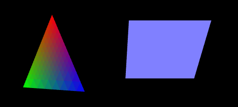

## 一点运动

这一节我们要让前面的三角和矩形动一动。想想我们看电影，无论是胶片的还是数字的，都不是绝对连续的，而是一帧一帧有微小区别的画面连起来，快速变换（大约一秒钟30帧），让人感觉是连续的。

WebGL也是这样，我们每隔很小的一段时间，往canvas上画一遍和前一个画面有微小差别的内容。

效果如图3。

>

>图3

首先修改webGLStart()。
```javascript
function webGLStart()
{
    //...
    //drawScene();
	tick();
}
```
drawScene()不再在这个地方执行，而是调用了一个我们后面要定义的tick()函数，，下面我们看看tick()做些什么。
```javascript
<script type="text/javascript">
	requestAnimFrame = window.requestAnimationFrame ||
		window.mozRequestAnimationFrame ||
		window.webkitRequestAnimationFrame ||
		window.msRequestAnimationFrame ||
		window.oRequestAnimationFrame ||
		function(callback) { setTimeout(callback, 1000 / 60); };
</script>
```
我们先在主程序外面额外写一段代码如上。由于标准不统一的问题，requestAnimationFrame这个功能在不同浏览器上有不同的名字，为了兼容，我们还用了或运算，用requestAnimFrame来统一代替它们，在下面的tick()中使用它。
```javascript
function tick()
{
	requestAnimFrame(tick);
```
requestAnimFrame(tick)表示定时反复执行tick()。大多我们做这类事的时候会用定时器setInterval，不过现在人们使用浏览器，一般会打开多个标签页，不同的标签页可能还有不同的WebGL内容，使用定时器的话，无论我们在浏览哪里，这个定时器都会一直跑，电脑压力蛮大的。requestAnimationFrame帮我们解决了这个问题，它会以一个合适的频率执行传入的函数，并且只在标签可见的时候运行。
```javascript
	drawScene();
	animate();
}
```
规律地执行tick()，我们便反复执行“画”和“动”了，drawScene()我们已了解，animate()就是计算下一时刻我们希望呈现的帧的样子。

```javascript
var rTri = 0;
var rSquare = 0;
```
定义两个全局变量表示三角和矩形旋转的状态，它们随时间变化。使用全局变量并不好，后面的章节中会介绍如何更优雅地组织这些变量。
```javascript
function drawScene()
{
	//...
	////mat4.translate(mvMatrix, mvMatrix, [-1.5, 0.0, -7.0]);
	mvPushMatrix();
	mat4.rotate(mvMatrix, mvMatrix, degToRad(rTri), [0, 1, 0]);
	////gl.drawArrays(gl.TRIANGLES, 0,
	////    triangleVertexPositionBuffer.numItems);
	mvPopMatrix();
	////mat4.translate(mvMatrix, mvMatrix, [ 3.0, 0.0,  0.0]);
	mvPushMatrix();
	mat4.rotate(mvMatrix, mvMatrix, degToRad(rSquare), [1, 0, 0]);
	//...
	////gl.drawArrays(gl.TRIANGLE_STRIP, 0,
	////    squareVertexPositionBuffer.numItems);
    mvPopMatrix();
}
```
我们在drawScene()中增加了一些代码。

这里消除一个常见误解（我当初就迷惑过），我们计算运动的时候，**不是**从上一帧状态计算这一帧状态，**而是**从初始状态通过时间差计算这一帧状态。所以我们在计算这一帧的运动状态前，先把初始状态保存起来，当画好这一帧之后，再把初始状态拿回来。

rotate()的参数中传入了一个向量，是旋转轴的方向。

mvPushMatrix()是我们自己实现的，将当前的模型-视图矩阵（初始状态）压栈暂存。degToRad()也是我们自己写的，简单地把“度数”转化为“弧度”。通过gl-matrix.js提供的方法，就方便地完成了旋转，计算出了图形在这个时间点对应的旋转位置。文中“////”表示插入新代码位置的上下文。

上面使用了rTri和rSquare，它们是需要根据“当前时间”来计算的。
```javascript
var lastTime = 0;
function animate()
{
	var timeNow = new Date().getTime();
	if(lastTime != 0)
	{
		var elapsed = timeNow - lastTime;

		rTri += (90 * elapsed) / 1000.0;
		rSquare += (75 * elapsed) / 1000.0;
	}
	lastTime = timeNow;
}
```
我们不断保存上一帧的时间，“这一帧”调用JS函数取得当前时间，然后计算三角和矩形应该转过的角度，转多快可以自己修改这部分代码来控制。

```javascript
var mvMatrixStack = [];

function mvPushMatrix()
{
	var copy = mat4.clone(mvMatrix);
```
数组的直接赋值是引用，操作新数组会改变原数组（可以用直接赋值看看效果的区别，俩形状转得更欢）。

所以这里用了gl-matrix.js提供的clone 。[LearningWebGL](http://learningwebgl.com)中使用的是“mat4.set(mvMatrix, copy)”，可能也是gl-matrix的1.x和2.x版本的区别，我看新版本中没有这个方法了。
```javascript
	mvMatrixStack.push(copy);
}
function mvPopMatrix()
{
	if(mvMatrixStack.length == 0)
	{
		throw "不合法的矩阵出栈操作!";
	}
	mvMatrix = mvMatrixStack.pop();
}
```
JS本身有在数组上的push和pop方法，所以mvMatrixStack数组当栈直接使用了。
```javascript
function degToRad(degrees)
{
	return degrees * Math.PI / 180;
}
```
0~180对应0~π的转换就很简单了。JS的Math对象有常用的数学常量与方法。