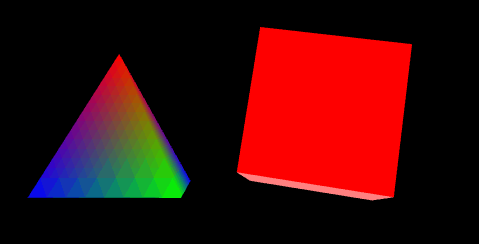

## 来点真正的3D

这节我们把三角改成四面体，矩形改成正方体。

效果如图4。


>

>图4

之前几节的图形是一个面，而立体的图形是由多个面组成的，我们一个面一个面地给出顶点坐标，画上去就得到了三维图形。

在绘制正方体的时候，我们增加一个索引。原因是：
1. 相邻的面是有公共点的，如果所有面都各自用坐标表示，就多了许多重复工作，这时我们增加一个索引（index），只需给出所有点的坐标，就可以用索引来重复使用点。
2. 如果我们用“POLYGON”画面，程序不清楚我们每个面有几条边，就要用for循环去一个面一个面画。如果用“TRIANGLE_STRIP”来画，则这个面画完，可能会和另一个面的顶点组成一个我们并不想画的三角形。如果用“TRIANGLES”来画，一个面四个点，等于两个三角形，两个公共点的坐标我们就需要多提供一次。使用索引+“TRIANGLES”，就方便多了。


为了让变量名更有意义一些，我们先把三角和矩形对应的变量名改成四面体和立方体。比如rTri改为rPyramid，triangleVertexPositionBuffer改成pyramidVertexPositionBuffer等等。

四面体用老方法来画，正方体用点索引的方法（具体方法是随意的，看怎么方便了）。

```javascript
var cubeVertexIndexBuffer;
```
增加全局变量，正方体顶点索引的buffer。

```javascript
function initBuffers()
{
	pyramidVertexPositionBuffer = gl.createBuffer();
	gl.bindBuffer(gl.ARRAY_BUFFER, pyramidVertexPositionBuffer);
	var vertices = [
					// 正面
					 0.0, 1.0, 0.0,
					-1.0, -1.0, 1.0,
					 1.0, -1.0, 1.0,
					// 右侧面
					 0.0, 1.0, 0.0,
					 1.0, -1.0, 1.0,
					 1.0, -1.0, -1.0,
					// 背面
					 0.0, 1.0, 0.0,
					 1.0, -1.0, -1.0,
					-1.0, -1.0, -1.0,
					// 左侧面
					 0.0, 1.0, 0.0,
					-1.0, -1.0, -1.0,
					-1.0, -1.0, 1.0
					];
	gl.bufferData(gl.ARRAY_BUFFER, new Float32Array(vertices),
		gl.STATIC_DRAW);
	pyramidVertexPositionBuffer.itemSize = 3;
	pyramidVertexPositionBuffer.numItems = 12;

	pyramidVertexColorBuffer = gl.createBuffer();
	gl.bindBuffer(gl.ARRAY_BUFFER, pyramidVertexColorBuffer);
	var colors = [
				 // 正面
				 1.0, 0.0, 0.0, 1.0,
				 0.0, 1.0, 0.0, 1.0,
				 0.0, 0.0, 1.0, 1.0,
				 // 右侧面
				 1.0, 0.0, 0.0, 1.0,
				 0.0, 0.0, 1.0, 1.0,
				 0.0, 1.0, 0.0, 1.0,
				 // 背面
				 1.0, 0.0, 0.0, 1.0,
				 0.0, 1.0, 0.0, 1.0,
				 0.0, 0.0, 1.0, 1.0,
				 // 左侧面
				 1.0, 0.0, 0.0, 1.0,
				 0.0, 0.0, 1.0, 1.0,
				 0.0, 1.0, 0.0, 1.0
				];
 	gl.bufferData(gl.ARRAY_BUFFER, new Float32Array(colors),
 		gl.STATIC_DRAW);
 	pyramidVertexColorBuffer.itemSize = 4;
 	pyramidVertexColorBuffer.numItems = 12;
```
对四面体，给出了三维世界中每个面的顶点坐标，相应的numItems也自然和三角的不一样了。
```javascript
	cubeVertexPositionBuffer = gl.createBuffer();
	gl.bindBuffer(gl.ARRAY_BUFFER, cubeVertexPositionBuffer);
	vertices = [
				// 正面
				-1.0, -1.0,  1.0,
				 1.0, -1.0,  1.0,
				 1.0,  1.0,  1.0,
				-1.0,  1.0,  1.0,

				// 背面
				-1.0, -1.0, -1.0,
				-1.0,  1.0, -1.0,
				 1.0,  1.0, -1.0,
				 1.0, -1.0, -1.0,

				// 顶部
				-1.0,  1.0, -1.0,
				-1.0,  1.0,  1.0,
				 1.0,  1.0,  1.0,
				 1.0,  1.0, -1.0,

				// 底部
				-1.0, -1.0, -1.0,
				 1.0, -1.0, -1.0,
				 1.0, -1.0,  1.0,
				-1.0, -1.0,  1.0,

				// 右侧面
				 1.0, -1.0, -1.0,
				 1.0,  1.0, -1.0,
				 1.0,  1.0,  1.0,
				 1.0, -1.0,  1.0,

				// 左侧面
				-1.0, -1.0, -1.0,
				-1.0, -1.0,  1.0,
				-1.0,  1.0,  1.0,
				-1.0,  1.0, -1.0,
				];
	gl.bufferData(gl.ARRAY_BUFFER, new Float32Array(vertices),
		gl.STATIC_DRAW);
	cubeVertexPositionBuffer.itemSize = 3;
	cubeVertexPositionBuffer.numItems = 24;

	cubeVertexColorBuffer = gl.createBuffer();
	gl.bindBuffer(gl.ARRAY_BUFFER, cubeVertexColorBuffer);
	colors = [
			  [1.0, 0.0, 0.0, 1.0],	 // 正面
			  [1.0, 1.0, 0.0, 1.0],	 // 背面
			  [0.0, 1.0, 0.0, 1.0],	 // 顶部
			  [1.0, 0.5, 0.5, 1.0],	 // 底部
			  [1.0, 0.0, 1.0, 1.0],	 // 右侧面
			  [0.0, 0.0, 1.0, 1.0]	 // 左侧面
			];
	var unpackedColors = [];
	for (var i in colors)
	{
		var color = colors[i];
		for (var j=0; j < 4; j++)
		{
			unpackedColors = unpackedColors.concat(color);
		}
	}
	gl.bufferData(gl.ARRAY_BUFFER, new Float32Array(unpackedColors),
		gl.STATIC_DRAW);
	cubeVertexColorBuffer.itemSize = 4;
	cubeVertexColorBuffer.numItems = 24;
```

代码还是把中正方体每个面的顶点分别给出了，以便给不同的面设置不同颜色，因为一个点有三个相邻面，我们无法给一个点设置三种颜色，但是可以在同一个位置放三个不同颜色的点。

颜色按顶点的顺序对应给出，这个for循环代码的逻辑，思考一下应该会明白。

```javascript
	cubeVertexIndexBuffer = gl.createBuffer();
	gl.bindBuffer(gl.ELEMENT_ARRAY_BUFFER, cubeVertexIndexBuffer);
	var cubeVertexIndices = 
		[
		  0, 1, 2,	  0, 2, 3,	// 正面
		  4, 5, 6,	  4, 6, 7,	// 背面
		  8, 9, 10,	 8, 10, 11,  // 顶部
		  12, 13, 14,   12, 14, 15, // 底部
		  16, 17, 18,   16, 18, 19, // 右侧面
		  20, 21, 22,   20, 22, 23  // 左侧面
		];
	gl.bufferData(gl.ELEMENT_ARRAY_BUFFER, 
	    new Uint16Array(cubeVertexIndices), gl.STATIC_DRAW);
	cubeVertexIndexBuffer.itemSize = 1;
	cubeVertexIndexBuffer.numItems = 36;
}
```
索引的设置方法与前面的顶点、颜色类似，只是相应改变了一些参数，如gl.ELEMENT_ARRAY_BUFFER、Uint16Array等。

```javascript
function drawScene()
{
    //...
	gl.bindBuffer(gl.ELEMENT_ARRAY_BUFFER, cubeVertexIndexBuffer);
	setMatrixUniforms();
	gl.drawElements(gl.TRIANGLES,
		cubeVertexIndexBuffer.numItems, gl.UNSIGNED_SHORT, 0);
	////mvPopMatrix();
}
```
绘制的时候，四面体依然使用gl.drawArrays()直接顶点数组画。对正方体使用索引来绘制，函数相应改为gl.drawElements()，当然执行绘制函数之前绑定的buffer也要对应IndexBuffer。

这样我们就得到了两个立体的旋转着的图形。
