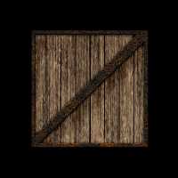

## 键盘交互与纹理过滤
这一节做一些简单的交互，并认识一下不同的纹理过滤类型。

效果如图6。

>

>图6

用四个方向键控制绕x轴和绕y轴的旋转，Page Up和Page Down键控制z轴方向上的放大与缩小，用F键在三种纹理过滤类型间切换。
```javascript
var xRot = 0;
var xSpeed = 0;
var yRot = 0;
var ySpeed = 0;
var z = -5.0;
var filter = 0;
```
与旋转、缩放、纹理过滤类型标记有关的全局变量。

```javascript
var crateTextures = Array();
function initTexture()
{
	var crateImage = new Image();
	for(var i = 0; i < 3; i ++)
	{
		var texture = gl.createTexture();
		texture.image = crateImage;
		crateTextures.push(texture);
	}
	crateImage.onload = function()
	{
		handleLoadedTexture(crateTextures);
	}
	crateImage.src = "/Public/image/crate.gif";
}
```
与上一节不同的是，我们创建了三个纹理对象，存到了一个数组里，纹理换成了一个板条箱的图片。这次传给handleLoadedTexture()的是一个数组。
```javascript
function handleLoadedTexture(textures)
{
	gl.pixelStorei(gl.UNPACK_FLIP_Y_WEBGL, 1);

	gl.bindTexture(gl.TEXTURE_2D, textures[0]);
	gl.texImage2D(gl.TEXTURE_2D, 0, gl.RGBA, gl.RGBA,
		gl.UNSIGNED_BYTE, textures[0].image);
	gl.texParameteri(gl.TEXTURE_2D,
		gl.TEXTURE_MAG_FILTER, gl.NEAREST);
	gl.texParameteri(gl.TEXTURE_2D,
		gl.TEXTURE_MIN_FILTER, gl.NEAREST);

	gl.bindTexture(gl.TEXTURE_2D, textures[1]);
	gl.texImage2D(gl.TEXTURE_2D, 0, gl.RGBA, gl.RGBA,
		gl.UNSIGNED_BYTE, textures[0].image);
	gl.texParameteri(gl.TEXTURE_2D,
		gl.TEXTURE_MAG_FILTER, gl.LINEAR);
	gl.texParameteri(gl.TEXTURE_2D,
		gl.TEXTURE_MIN_FILTER, gl.LINEAR);

	gl.bindTexture(gl.TEXTURE_2D, textures[2]);
	gl.texImage2D(gl.TEXTURE_2D, 0, gl.RGBA, gl.RGBA,
		gl.UNSIGNED_BYTE, textures[0].image);
	gl.texParameteri(gl.TEXTURE_2D,
		gl.TEXTURE_MAG_FILTER, gl.LINEAR);
	gl.texParameteri(gl.TEXTURE_2D,
		gl.TEXTURE_MIN_FILTER, gl.LINEAR_MIPMAP_NEAREST);

	gl.generateMipmap(gl.TEXTURE_2D);

	gl.bindTexture(gl.TEXTURE_2D, null);
}
```
对传进来的纹理对象数组中三个对象使用了三种参数组合。
textures[0]和上一节一样，gl.NEAREST。
NEAREST
