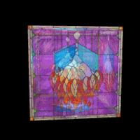

## 深度缓冲，透明度与混合

###深度缓冲

回顾一下渲染管线：

1. 每个顶点被顶点着色器处理一次，进行相应的变换；
2. 顶点之间进行线性插值，得到许多片元递给片元着色器；
3. 每个片元被片元着色器处理一次，算出它的颜色；
4. 把结果送给帧缓存。

如果模型中有前后多个物体，同一个像素就会传入不同的颜色让片元着色器处理多次，我们肯定只绘制最前面物体的颜色，遮挡后面的物体，着色器如何知道哪个前哪个后，这就需要深度缓冲。深度缓冲记录着每个像素点的深度，在绘制每个像素之前，如果启用了深度缓冲，系统会把它的深度值和已经存储在缓冲里的这个像素的深度值进行比较，而具体保留哪个值，由设置决定。

###混合

混合常用来绘制透明或半透明物体。混合是把对应同一个片元的不同物体的颜色，通过需要的方式结合在一起计算，得到一个新的颜色送入帧缓存。具体用什么方式计算，也由设置决定。

这一节，我们分别看使用深度缓冲的效果，与使用混合来实现半透明的效果，如图9。

>

>图9

```html
<input type="checkbox" id="blending" checked /> 使用混合
<br/>
不透明度（Alpha）级别 <input type="text" id="alpha" value="0.5" /><br/>
```
首先加上这一节用的混合开关与不透明度设置的控件。

```html
<script id = "shader-fs" type = "x-shader/x-fragment">
    //...
	uniform float uAlpha;
	void main(void)
	{
		//...
		gl_FragColor =
			vec4(textureColor.rgb * vLightWeighting, textureColor.a * uAlpha);
	}
</script>
```
然后修改片元着色器，加入不透明度的设置。

在webGLStart()中，我们一直有这样一行代码：
```javascript
	gl.enable(gl.DEPTH_TEST);
```

相当于告诉WebGL，注意深度缓冲。深度处理已经有一个默认的策略，即常规理解的近处挡住远处的物体。我们也可以明确指定这个策略：

```javascript
	gl.depthFunc(gl.LESS);
```
当然也可以进行其它的设定，这里就不涉及了。

```javascript
function drawScene()
{
    //...
	var blending = $("#blending").is(":checked");
	if(blending)
	{
		gl.blendFunc(gl.SRC_ALPHA, gl.ONE);
```

gl.blendFunc(gl.SRC_ALPHA, gl.ONE)
第一个参数指定红绿蓝和alpha**源**混合因子如何计算，第二个参数指定红绿蓝和alpha**目标**混合因子如何计算。
源混合因子就是片元着色器正在画的这个片元，目标混合因子是已经送入帧缓存的片元。

gl.SRC_ALPHA表示使用源颜色的alpha值作为因子，gl.ONE表示用1.0作为因子。其他参数可上网查阅。

设源颜色为Color<sub>s</sub> = (R<sub>s</sub>, G<sub>s</sub>, B<sub>s</sub>, A<sub>s</sub>)，目标颜色为Color<sub>d</sub> = (R<sub>d</sub>, G<sub>d</sub>, B<sub>d</sub>, A<sub>d</sub>)，则按照我们这里使用的参数，计算结果为：
Color<sub>result</sub> = Color<sub>s</sub> * A<sub>s</sub> + Color<sub>d</sub>

这种方式不会是产生透明效果最好的方法，不过在这个例子中效果还不错。

理清一个概念：透明的视觉效果不能和颜色参数中“不透明度”混淆，并不是说把“前面物体”的Alpha降低，“后面物体”就能被看到，那是“上帝算法”。计算机图形中的透明是通过两个物体颜色的合理混合，得到一个颜色作为结果，产生的半透明效果，如果想理解为“视觉欺骗”也无不可。
```javascript
		gl.enable(gl.BLEND);
		gl.disable(gl.DEPTH_TEST);
		gl.uniform1f(shaderProgram.alphaUniform, parseFloat($("#alpha").val()));
	}
	else
	{
		gl.disable(gl.BLEND);
		gl.enable(gl.DEPTH_TEST);
		gl.uniform1f(shaderProgram.alphaUniform, 1);
	}
}
```
根据网页控件上的开关，控制BLEND和DEPTH_TEST的开关，读取网页上设置的alpha值。

好了，这节该有的效果有了，不过不透明度设置并不完美。比如把方向光X、Y设为0，Z设为1，按理说透明玻璃，光会照过来的嘛，但是并没有。
所以大家知道了，任何效果都是要计算的，而不是像我们在真实世界中那么简单的因果关系，更好的透明效果，需要更细致的对光、绘制方式的设计。
