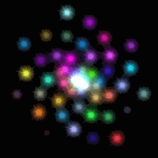

## 优化代码结构，多物体运动

这次画多个相同的运动物体，把这个物体封装成一个类，用一个像闪耀的星星的纹理，来给每个星星加特技，Duang~

效果如图10。

>

>图10

简单来说，JS定义对象和常见的C++、PHP不大一样，不是一个class{}或是struct{}的样子。JS的每个函数就是一个对象，函数对象有一个子对象prototype，用new创建一个类的实例对象的时候，prototype对象的成员都成为实例化对象的成员，具体来看代码。

```javascript
function Star(startingDistance, rotationSpeed)
{
	this.angle = 0;
	this.dist = startingDistance;
	this.rotationSpeed = rotationSpeed;
	//设置一个起始颜色
	this.randomiseColors();
}
```
我们定义Star这么个类，同时这就是它的构造函数，有三个成员变量，还执行了一个自己的方法。

```javascript
Star.prototype.randomiseColors = function()
{
	//给星星一个随机的颜色
	this.r = Math.random();
	this.g = Math.random();
	this.b = Math.random();
	//如果打开了发亮开关，则多绘制一次，用另一个随机的颜色作为亮光
	this.twinkleR = Math.random();
	this.twinkleG = Math.random();
	this.twinkleB = Math.random();
};
```
构造函数中调用的方法，给自己设置一下颜色。
```javascript
var effectiveFPMS = 60 / 1000;
Star.prototype.animate = function(elapsedTime)
{
	this.angle += this.rotationSpeed * effectiveFPMS * elapsedTime;
	//逐步减小与中心的距离
	this.dist -= 0.01 * effectiveFPMS * elapsedTime;
	if(this.dist < 0.0)
	{
		this.dist += 5.0;
		this.randomiseColors();
	}
};
```
不同物体相互独立，它们的运动也应该是相互独立的，这个函数让它们“自己动”。这个代码表示了一个螺旋运动，当“星星”到了中心，就把它挪回最外面继续往里螺旋运动。

把速度理解为相邻两帧画面的运动距离，effectiveFPMS就理解为60帧每秒的情况下，每毫秒多少帧，进而计算每个tick()周期一次跑了多远。

旋转的速度、平移的速度合理设计，才能看到想要的效果，比如如果把旋转速度都设成一样的，那估计就看到的是一根闪亮的棒子一圈圈地转了。

```javascript
Star.prototype.draw = function(tilt, spin, twinkle)
{
	mvPushMatrix();
	//移动到位
	mat4.rotate(mvMatrix, mvMatrix, degToRad(this.angle), [0.0, 1.0, 0.0]);
	mat4.translate(mvMatrix, mvMatrix, [this.dist, 0.0, 0.0]);
	//旋转
	mat4.rotate(mvMatrix, mvMatrix, degToRad(-this.angle), [0.0, 1.0, 0.0]);
	mat4.rotate(mvMatrix, mvMatrix, degToRad(-tilt), [1.0, 0.0, 0.0]);
	if(twinkle)
	{
		//画一个不旋转的star
		gl.uniform3f(shaderProgram.colorUniform,
			this.twinkleR, this.twinkleG, this.twinkleB);
		drawStar();
	}
	//所有Star围绕Z旋转
	mat4.rotate(mvMatrix, mvMatrix, degToRad(spin), [0.0, 0.0, 1.0]);
	//画颜色
	gl.uniform3f(shaderProgram.colorUniform, this.r, this.g, this.b);
	drawStar();
	mvPopMatrix();
};
```
接着设置一个“自己控制如何画自己”的函数，先把变换矩阵压栈，这是前面章节用过的，以保证算完这个星星之后，不影响别的星星。

注意别忘了每个星星不是一个点，而是多个点组成的图形贴上纹理，这里的旋转就是对顶点的操作。我们这次画的是一个个贴上纹理的正方形，是个平面图形，那么星星既要围绕Y轴旋转，又要在用户的控制下围绕X轴旋转，还得始终“面对”观察者而不至于成为一个“扁片”，于是就有了这些旋转。

这里要说一下矩阵变换的问题。
* 矩阵相乘，是左边矩阵的行去乘右边矩阵的列，我们习惯在矩阵中一行一行的思考问题，所以变换矩阵习惯上是乘在坐标矩阵左边的，可参考顶点shader的代码。

而变换矩阵在左边，施加变换在顶点上的顺序，则与我们对变换矩阵做的操作顺序是**相反的**。

于是我们倒着看上面的几个操作。首先我们的视角是在Z轴上“俯视”XY平面，先按spin让每个星星“自转”，再让星星沿X轴以tilt相反方向转（这样后面我们整体旋转视角的时候，才能让星星纹理“正对”我们），接着让星星沿Y轴反向转（也是为了后面旋转保证纹理“正对”我们），再沿X轴平移（这时候星星中心才离开原点），然后沿着Y轴转到星星最终的位置。在这一系列变换之前（mvPushMatrix()之前），会在drawScene()中设置一个沿X轴按tilt的正向旋转，那么按照逆序，这将是最后对所有星星的统一操作。于是得到了全部“面对”我们的，沿着X轴有一个我们设定的倾角的一群旋转的星星。

```javascript
function drawStar()
{
	gl.activeTexture(gl.TEXTURE0);
	gl.bindTexture(gl.TEXTURE_2D, starTexture);
	gl.uniform1i(shaderProgram.samplerUniform, 0);

	gl.bindBuffer(gl.ARRAY_BUFFER, starVertexTextureCoordBuffer);
	gl.vertexAttribPointer(shaderProgram.textureCoordAttribute,
		starVertexTextureCoordBuffer.itemSize, gl.FLOAT, false, 0, 0);

	gl.bindBuffer(gl.ARRAY_BUFFER, starVertexPositionBuffer);
	gl.vertexAttribPointer(shaderProgram.vertexPositionAttribute,
		starVertexPositionBuffer.itemSize, gl.FLOAT, false, 0, 0);

	setMatrixUniforms();
	gl.drawArrays(gl.TRIANGLE_STRIP, 0, starVertexPositionBuffer.numItems);
}
```
和之前一样的画法，每次画一个星星。

```javascript
function webGLStart()
{
	//...
	initWorldObjects();
}
var stars = [];
function initWorldObjects()
{
	var numStars = 50;
	for(var i = 0; i < numStars; i ++)
	{
		stars.push(new Star((i / numStars) * 5.0, i / numStars));
	}
}
```
前面定义了星星的类，这里实例化50个对象。
```javascript
function drawScene()
{
	gl.viewport(0, 0, gl.viewportWidth, gl.viewportHeight);
	gl.clear(gl.COLOR_BUFFER_BIT | gl.DEPTH_BUFFER_BIT);

	mat4.perspective(pMatrix, 45,
		gl.viewportWidth / gl.viewportHeight, 0.1, 100.0);

	gl.blendFunc(gl.SRC_ALPHA, gl.ONE);
	gl.enable(gl.BLEND);

	mat4.identity(mvMatrix);

	mat4.translate(mvMatrix, mvMatrix, [0.0, 0.0, zoom]);

	mat4.rotate(mvMatrix, mvMatrix, degToRad(tilt), [1, 0, 0]);

	var twinkle = $("#twinkle").is(":checked");
	for(var i in stars)
	{
		stars[i].draw(tilt, spin, twinkle);
		spin += 0.1;
	}
}
```
把分别画每个星星的代码，放到了一个循环里。

除了把图形封装起来之外，没有什么太多不一样的，相信学到这一节，对大多代码的功能已经很熟悉了，其他地方的修改就不再作说明，可以参考附录的完整代码。
